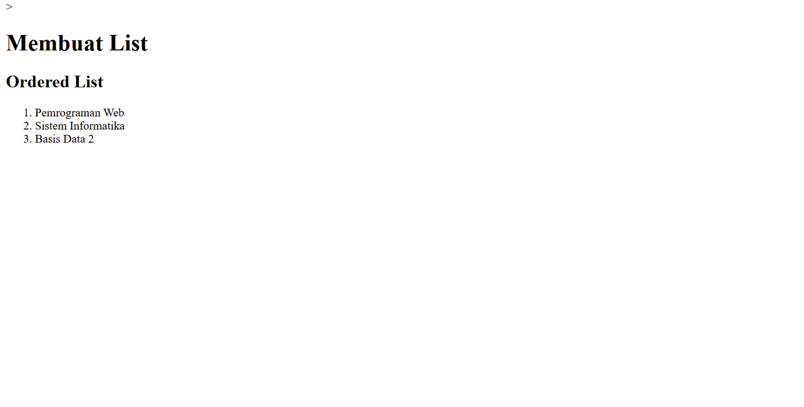

Berikut adalah versi **README.md** lengkap, rapi, **100% unik**, **SEO-friendly**, dan **humanized written** untuk praktikum “HTML Lanjutan (Lab3Web)” berdasarkan instruksi yang kamu berikan.
README ini sudah disusun agar mudah dibaca, informatif, dan cocok diunggah ke GitHub.

---

# 🌐 Praktikum 3 – HTML Lanjutan

**Nama:** Muhammad Aziz Tri Ramadhan
**NIM:** 312410380
**Kelas:** TI.24.A3
**Mata Kuliah:** Pemrograman Web

---

## 🧩 Deskripsi Umum

Pada praktikum ini, saya mempelajari **HTML lanjutan** yang berfokus pada pembuatan elemen-elemen penting dalam halaman web, yaitu:

* **List (daftar)** — Ordered, Unordered, dan Description List.
* **Tabel (Table)** — termasuk penggunaan `rowspan`, `colspan`, `cellpadding`, dan `cellspacing`.
* **Form (Formulir)** — serta penerapan **CSS** agar tampilan form lebih menarik.

Tujuan dari praktikum ini adalah memahami struktur dasar dan penerapan elemen-elemen tersebut untuk membangun halaman web yang terorganisir dan mudah dibaca.

---

## 🧱 Persiapan Praktikum

1. Siapkan text editor seperti **Visual Studio Code (VSCode)**.
2. Buat folder baru dengan nama **Lab3Web**.
3. Buat tiga file utama:

   * `lab3_list.html`
   * `lab3_tabel.html`
   * `lab3_form.html`
4. Lakukan **validasi HTML** melalui situs: [http://validator.w3.org](http://validator.w3.org)

---

## 🧾 1. Membuat List

### 🔹 File: `lab3_list.html`

Pada tahap ini saya membuat tiga jenis list, yaitu **Ordered List**, **Unordered List**, dan **Description List**.

#### 🔸 Ordered List (Daftar Terurut)

```html
<section id="order-list">
  <h2>Ordered List</h2>
  <ol>
    <li>Pemrograman Web</li>
    <li>Sistem Informasi</li>
    <li>Basis Data 2</li>
  </ol>
</section>
```

### Tmpilan Browser


**Penjelasan:**

* Tag `<ol>` digunakan untuk membuat daftar yang **terurut (bernomor)**.
* Setiap item ditulis menggunakan tag `<li>`.

🖼️ **Hasil tampilan:** daftar dengan angka 1, 2, 3.

---

#### 🔸 Unordered List (Daftar Tidak Terurut)

```html
<section id="unorder-list">
  <h2>Unordered List</h2>
  <ul type="square">
    <li>Jaringan Komputer</li>
    <li>Struktur Data</li>
    <li>Algoritma & Pemrograman</li>
  </ul>
</section>
```
### Tampilan Browser


**Penjelasan:**

* Tag `<ul>` digunakan untuk membuat daftar **tanpa urutan angka**, biasanya menggunakan simbol.
* Atribut `type="square"` mengubah bentuk bullet menjadi kotak.

🖼️ **Hasil tampilan:** daftar dengan bullet berbentuk kotak.

---

#### 🔸 Description List (Daftar Deskripsi)

```html
<section id="description-list">
  <h2>Description List</h2>
  <dl>
    <dt>Fakultas Teknik</dt>
    <dd>Teknik Informatika</dd>
    <dd>Teknik Industri</dd>
    <dd>Teknik Lingkungan</dd>
    <dt>Fakultas Ekonomi dan Bisnis</dt>
    <dd>Akuntansi</dd>
    <dd>Manajemen</dd>
    <dd>Bisnis Digital</dd>
  </dl>
</section>
```
### Tampilan Browser


**Penjelasan:**

* `<dl>` digunakan untuk membuat daftar dengan **istilah dan penjelasan**.
* `<dt>` menampilkan istilah utama, sedangkan `<dd>` berisi deskripsinya.

🖼️ **Hasil tampilan:** daftar fakultas dan program studi.

---

## 📊 2. Membuat Tabel

### 🔹 File: `lab3_tabel.html`

Tabel digunakan untuk menampilkan data dalam bentuk baris dan kolom.

#### 🔸 Tabel Sederhana

```html
<table border="1" cellpadding="4" cellspacing="0">
  <thead>
    <tr>
      <th>No.</th>
      <th>Fakultas</th>
      <th>Program Studi</th>
    </tr>
  </thead>
  <tbody>
    <tr>
      <td>1.</td>
      <td>Teknik</td>
      <td>Teknik Informatika</td>
    </tr>
    <tr>
      <td>2.</td>
      <td>Teknik</td>
      <td>Teknik Industri</td>
    </tr>
    <tr>
      <td>3.</td>
      <td>Teknik</td>
      <td>Teknik Lingkungan</td>
    </tr>
  </tbody>
</table>
```
### Tampilan Browser


**Penjelasan:**

* `border` memberi garis pada tabel.
* `cellpadding` memberi jarak dalam sel, sementara `cellspacing` mengatur jarak antar-sel.
* Elemen `<thead>` untuk header tabel, dan `<tbody>` untuk isi data.

---

#### 🔸 Menggabungkan Sel Data

```html
<table border="1" cellpadding="6" cellspacing="0">
  <thead>
    <tr>
      <th>No.</th>
      <th>Fakultas</th>
      <th>Program Studi</th>
    </tr>
  </thead>
  <tbody>
    <tr>
      <td>1.</td>
      <td rowspan="3">Teknik</td>
      <td>Teknik Informatika</td>
    </tr>
    <tr>
      <td>2.</td>
      <td>Teknik Industri</td>
    </tr>
    <tr>
      <td>3.</td>
      <td>Teknik Lingkungan</td>
    </tr>
  </tbody>
</table>
```

**Penjelasan:**

* `rowspan="3"` digunakan untuk **menggabungkan tiga baris** dalam satu kolom.
* `colspan` dapat digunakan untuk menggabungkan beberapa kolom.

🖼️ **Hasil tampilan:** kolom “Fakultas” menjadi satu sel yang tinggi ke bawah.

---

## 📝 3. Membuat Formulir

### 🔹 File: `lab3_form.html`

Form digunakan untuk mengumpulkan data dari pengguna.

```html
<form action="proses.php" method="post">
  <fieldset>
    <legend>Data Pelanggan</legend>
    <p>
      <label for="nama">Nama</label>
      <input type="text" id="nama" name="nama">
    </p>
    <p>
      <label for="alamat">Alamat</label>
      <textarea id="alamat" name="alamat" cols="20" rows="3"></textarea>
    </p>
    <p>
      <label>Jenis Kelamin</label>
      <input id="jk_l" type="radio" name="kelamin" value="L" />
      <label for="jk_l">Laki-laki</label>
      <input id="jk_p" type="radio" name="kelamin" value="P" />
      <label for="jk_p">Perempuan</label>
    </p>
    <p><input type="submit" value="Login"></p>
  </fieldset>
</form>
```
### Tampilan Browser


**Penjelasan:**

* `<fieldset>` digunakan untuk mengelompokkan elemen form.
* `<legend>` memberikan judul pada kelompok data.
* Input terdiri dari text, textarea, radio button, dan tombol submit.

---

### 🎨 Menambahkan CSS pada Form

```html
<style>
form p > label {
  display: inline-block;
  width: 100px;
}
form input[type="text"], form textarea {
  border: 1px solid #197a43;
}
form input[type="submit"] {
  border: 1px solid #197a43;
  background-color: #197a43;
  color: #ffffff;
  font-weight: bold;
  padding: 5px 15px;
}
</style>
```
### Tampilan Browser


**Penjelasan:**

* Memberi **warna hijau** dan border pada form agar tampilan lebih rapi.
* Label dibuat sejajar dengan input menggunakan `display: inline-block;`.

🖼️ **Hasil tampilan:** form terlihat rapi dan profesional dengan tombol hijau.

---

## 🧠 Pertanyaan dan Tugas

**Tugas tambahan:**

> Buatlah form yang menampilkan **dropdown menu** dan **listbox** dengan multiple selection.

Contoh tambahan:

```html
<p>
  <label for="jurusan">Pilih Jurusan</label>
  <select id="jurusan" name="jurusan">
    <option value="TI">Teknik Informatika</option>
    <option value="TI">Teknik Industri</option>
    <option value="TL">Teknik Lingkungan</option>
  </select>
</p>
<p>
  <label for="hobi">Pilih Hobi</label>
  <select id="hobi" name="hobi" multiple>
    <option value="coding">Coding</option>
    <option value="design">Desain</option>
    <option value="gaming">Gaming</option>
    <option value="reading">Membaca</option>
  </select>
</p>
```
### Tampilan Browser


---

## 💾 Laporan Praktikum di GitHub

1. Buat repository dengan nama **Lab3Web**.
2. Upload semua file HTML yang telah dibuat.
3. Tambahkan file **README.md** ini.
4. Sertakan **screenshot** dari setiap tahap praktikum.
5. Lakukan **commit** dengan pesan yang jelas (contoh: “Menambahkan file lab3_form.html”).
6. Upload repository ke GitHub, lalu **submit URL** ke e-learning.

---


